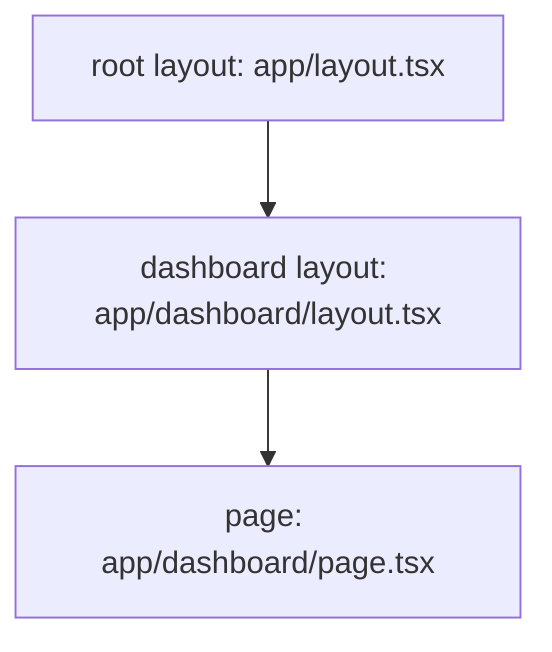
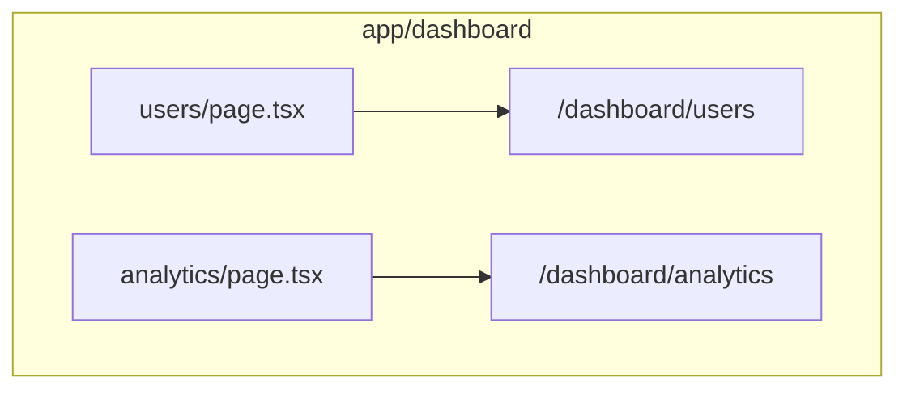
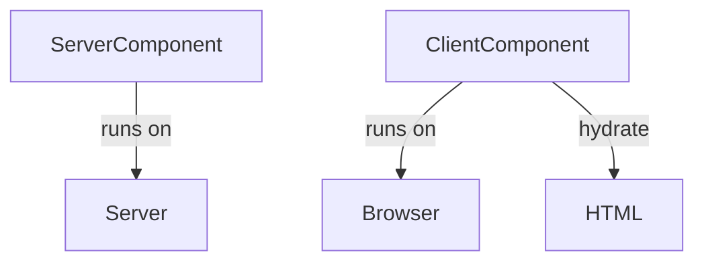

# 📘 Next.js 核心概念與功能

## 📂 路由 (Routing)

Next.js 採用 **基於檔案系統的路由 (File-system Routing)**。專案中 `app` 資料夾的結構，會直接對應到 URL 路徑：

```mermaid
graph LR
    subgraph app/
        index.tsx --> /
        about/page.tsx --> /about
        blog/[id]/page.tsx --> /blog/[id]
        dashboard/(users)/page.tsx --> /dashboard/users
    end
```

---

## 📐 佈局 (Layouts)

佈局用於在不同頁面之間共用 UI 結構。

- 根佈局定義於 `app/layout.tsx`，套用於整個應用
- 子佈局可嵌套在任何資料夾層級（例如：`app/dashboard/layout.tsx`）



---

## 📄 頁面 (Pages)

每個 `page.tsx` 對應唯一一個 URL 路徑：

- `app/page.tsx` → `/`
- `app/about/page.tsx` → `/about`

---

## 🔀 動態路由 (Dynamic Routes)

使用中括號 `[param]` 定義變數路徑：

```mermaid
graph LR
    A[/blog/[id]] --> B[page.tsx]
    B --> C{params: { id }}
```

- 例如：`app/blog/[id]/page.tsx` 匹配 `/blog/123` 或 `/blog/hello-world`

---

## 🔗 客戶端導航 (`<Link>`)

使用 Next.js 的 `<Link>` 元件進行 SPA 導航：

```tsx
import Link from 'next/link';

export default function HomePage() {
  return <Link href="/users">前往使用者頁面</Link>;
}
```

避免使用原生 `<a>` 導致頁面重新載入。

---

## 🧩 巢狀路由 (Nested Routes)



---

## 🗂️ 路由群組 (Route Groups)

以 `(group)` 建立結構，不影響實際 URL：

```mermaid
graph TD
    subgraph app/(dashboard)
        users/page.tsx --> /users
    end
    subgraph app/(marketing)
        about/page.tsx --> /about
    end
```

---

## 🧱 組件分類

### 📦 Server Components

- 執行於伺服器
- 可存取 DB、API 金鑰
- 無法用 `useState`、`useEffect`

### 🌐 Client Components

- 需在頂部宣告 `'use client'`
- 用於處理互動與瀏覽器 API
- 預先渲染後水合 (hydration)


