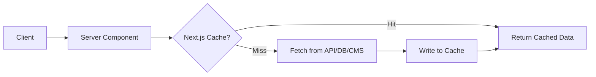

# 📡 Next.js App Router 資料獲取總覽

Next.js App Router 提供多種伺服器端優先的資料獲取方式，並內建快取、靜態生成與 CMS 整合能力。

---

## 📦 1. 原生 `fetch` API

- ✅ 可直接在 **伺服器組件中使用**（非 client component）
- ✅ 內建快取系統（自動 memoization）
- ✅ 支援選項控制行為：

| 選項            | 說明                     |
| --------------- | ------------------------ |
| `'force-cache'` | 預設，快取資料並重用     |
| `'no-store'`    | 每次都重新取得，不快取   |
| `revalidate`    | 設定秒數後觸發快取重驗證 |

```ts
const res = await fetch("https://api.example.com/data", {
  cache: "force-cache",
});
```

```mermaid
flowchart TD
  A[伺服器組件呼叫 fetch()] --> B{快取命中？}
  B -- 是 --> C[使用快取資料]
  B -- 否 --> D[發送請求至 API 或 DB]
  D --> E[取得資料並存入快取]
  E --> C
```

---

## 🧬 2. `generateStaticParams`

- 用於 **SSG（靜態網站生成）**，建置時決定所有變數參數的組合
- 常見於動態路由（如 `app/products/[id]/page.tsx`）

```ts
export async function generateStaticParams() {
  const products = await fetchAllProducts();
  return products.map((p) => ({ id: p.id }));
}
```

```mermaid
flowchart TD
  A[build process] --> B[執行 generateStaticParams()]
  B --> C[取得參數列表]
  C --> D[針對每個參數執行 SSR]
  D --> E[產出 .html/.json 靜態頁]
```

---

## 🧪 3. `unstable_cache`（進階快取控制）

- 手動包裹 fetch 邏輯以達更細節的快取行為
- 可指定過期時間、標籤（暫不建議大量使用）

```ts
import { unstable_cache } from "next/cache";

const fetchData = unstable_cache(
  async () => {
    return fetch("https://example.com/data").then((res) => res.json());
  },
  ["custom-key"],
  { revalidate: 3600 }
);
```

---

## 🔧 4. 資料獲取最佳實踐（伺服器組件）

- ✅ 伺服器端資料安全性高（可使用 API key / DB）
- ✅ 支援 async/await、效能好、適合 SEO
- ❌ 無法在 Client Component 中使用 `fetch()` 獲取伺服器機密資料

---

## 📚 5. Sanity CMS 整合

- Sanity 是支援 GROQ 查詢的 headless CMS
- Next.js 可透過 `@sanity/client` 與 `next-sanity/live` 整合

```ts
import { createClient } from "@sanity/client";

const client = createClient({
  projectId: "your-id",
  dataset: "production",
  apiVersion: "2023-01-01",
  useCdn: true,
});

const posts = await client.fetch('*[_type == "post"]');
```

- Live 更新可透過 `<SanityLive>` 即時顯示變更內容

---

## 🧠 整體流程圖

### ☁️ 通用伺服器端資料流程



### 📄 靜態生成與 ISR 整合

```mermaid
flowchart TD
  A[build process] --> B[generateStaticParams]
  B --> C[fetch 資料 + render 靜態頁]
  C --> D[靜態檔產出 (.html/.json)]
  D --> E[部署上 CDN]

  E --> F[User Request] --> G{快取過期？}
  G -- 否 --> H[直接回應頁面]
  G -- 是 --> I[背景重新產生頁面]
```
