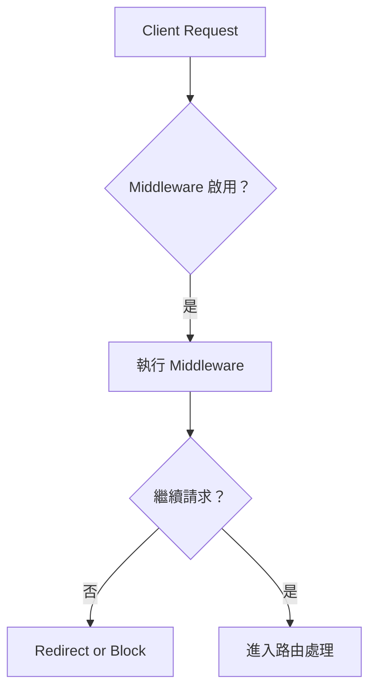
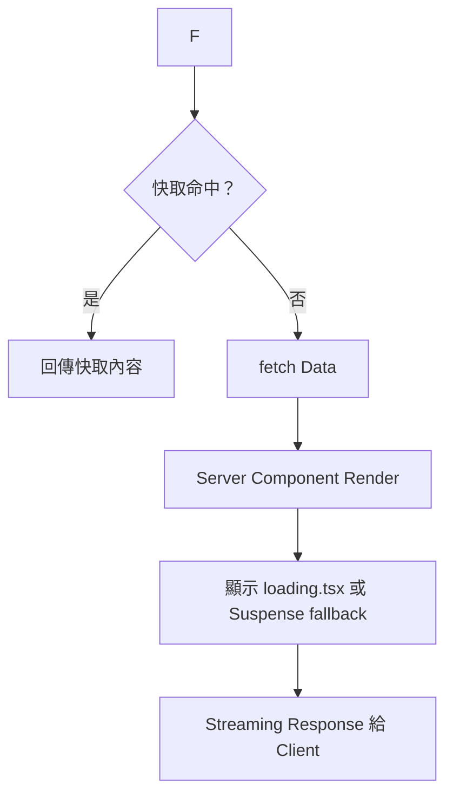

# ⚙️ Next.js App Router 核心功能指南

本指南涵蓋 App Router 中的以下關鍵特性：

- 快取策略（Caching）
- 中介層處理（Middleware）
- 錯誤管理（Error Handling）
- 載入 UI 與串流技術（Loading UI & Streaming）

---

## 🔐 快取策略（Caching）

Next.js 提供多層級的快取控制機制，例如：

- `fetch()` 預設使用 `force-cache`
- Sanity 使用 `useCDN: true` 則預設快取 60 秒（ISR）
- Partial Prerendering (PPR) 可針對靜態內容設定快取層級

### 快取流程圖：

```mermaid
graph TD
    A[用戶請求] --> B{快取命中？}
    B -- 是 --> C[直接提供快取內容]
    B -- 否 --> D[後端資料請求 fetch()]
    D --> E[產生頁面 HTML]
    E --> F[更新快取後回應]
```

---

## 🧩 中介層（Middleware）

Middleware 可在請求抵達路由處理器前先行攔截。

### 常見用途：

- 驗證與授權檢查
- 記錄請求資訊
- 根據條件進行 URL 重寫 / 重導

```ts
// middleware.ts
import { NextResponse } from 'next/server'
export function middleware(req) {
  if (!req.cookies.has('auth')) {
    return NextResponse.redirect('/login')
  }
  return NextResponse.next()
}
```

---

## ❌ 錯誤處理（Error Handling）

### 1. `notFound()` – 顯示 404 頁面

```ts
import { notFound } from 'next/navigation'
if (!user) notFound()
```

可自訂 `app/not-found.tsx` 提供專屬 UI。

### 2. `error.tsx` – 捕捉渲染錯誤

每個路由目錄可新增 `error.tsx`：

```tsx
export default function Error({ error }: { error: Error }) {
  return <div>系統錯誤：{error.message}</div>
}
```

---

## 🔁 載入 UI + 串流 Streaming

### `loading.tsx`

- 放於每個路由資料夾中
- 自動顯示於資料尚未載入階段

### `<Suspense fallback>` (細粒度控制)

```tsx
import { Suspense } from 'react'

<Suspense fallback={<LoadingSpinner />}>
  <SomeDynamicComponent />
</Suspense>
```

### 串流（Streaming）

- 搭配 Suspense 可先送出靜態外殼
- 用戶體驗提升（更快看到內容）

---

## 🔄 串流與中介層總覽（Mermaid 流程圖）

### ✅ Middleware + Routing + Caching



### ✅ Streaming 渲染階段


