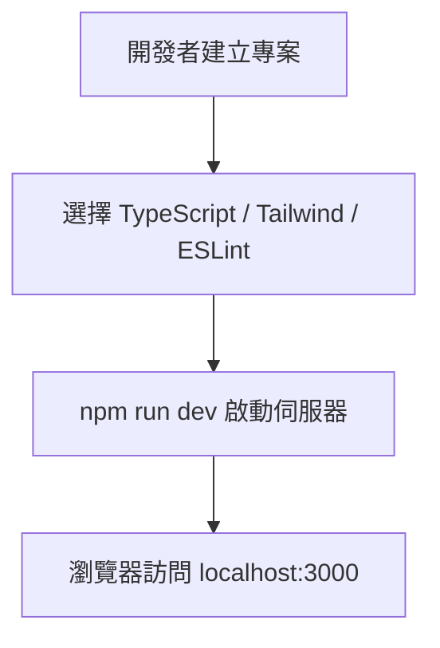
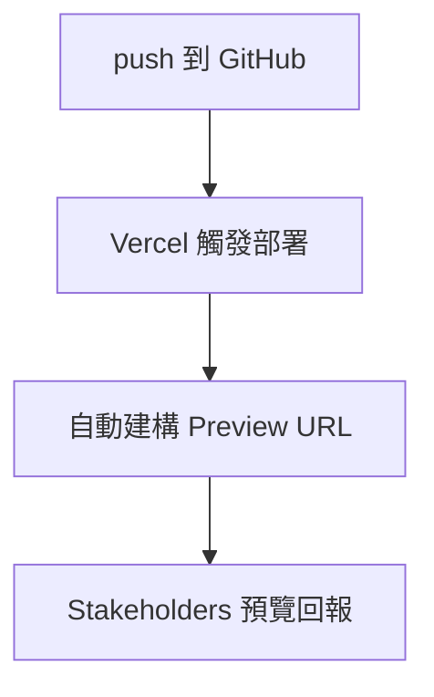
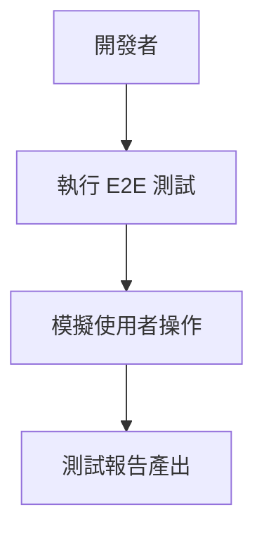

# 🛠️ Next.js App Router 開發環境與核心概念

本指南將說明開發 App Router 應用時所需的開發環境、專案結構、樣式處理、部署與測試整合等要點，並輔以 Mermaid 圖表說明工作流程。

---

## 🧰 開發環境設定

1. 安裝 Node.js 版本 **16.8 以上**
2. 使用 CLI 建立專案：
```bash
npx create-next-app@13.4.13 my-app
```
3. 啟動開發伺服器：
```bash
cd my-app
npm run dev
```

### 📊 開發流程圖


---

## 📁 專案結構（App Router）

- `app/`：App Router 核心，路由配置與 UI 架構
- `public/`：放置靜態資源（圖片等）
- `styles/`：全域樣式或 CSS modules
- `(group)/`：Route Groups，可分組不改變實際 URL

```mermaid
graph TD
    app/ --> page.tsx
    app/ --> layout.tsx
    app/(group)/ --> about/page.tsx
    public/ --> logo.png
```

---

## 🎨 樣式整合

### CSS Modules
- 命名方式：`*.module.css`
- 自動作用域，避免樣式衝突

### Tailwind CSS
- 可於專案初始化選擇安裝
- 編輯 `global.css` 並引入：
```css
@tailwind base;
@tailwind components;
@tailwind utilities;
```

---

## 🚀 部署至 Vercel

- 原生支援 Next.js 的無伺服器平台
- 支援 PR 預覽、CDN、自動擴展



---

## 🧪 測試系統

### 1️⃣ 單元與整合測試（Jest + RTL）
```bash
npm install -D jest @testing-library/react @testing-library/jest-dom ts-jest
```
新增 `jest.config.js` 設定檔：

```js
module.exports = {
  testEnvironment: "jsdom",
  transform: {
    "^.+\.(ts|tsx)$": "ts-jest"
  }
}
```

### 2️⃣ E2E 測試（Playwright）
```bash
npx playwright install
npx playwright codegen http://localhost:3000
```


