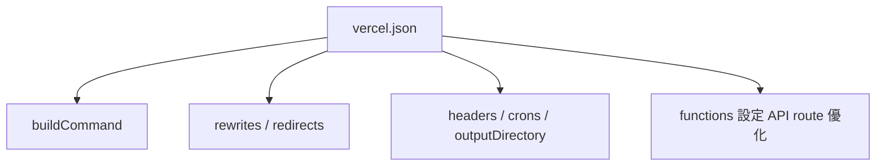

# ⚡ Next.js 應用優化與進階設定指南

涵蓋 SEO metadata、圖片與字體優化、草稿模式、指令碼載入與 Vercel 整合設定等重要主題，協助你打造高效能、易維護的 Next.js 應用程式。

---

## 🔍 SEO 與 Metadata

Next.js 提供兩種方式設定 `<meta>` 標籤：

### ✅ 靜態 Metadata
```ts
export const metadata = {
  title: "網站標題",
  description: "網站描述",
}
```

### ⚙️ 動態 Metadata（建議用於部落格、CMS）
```ts
export async function generateMetadata({ params }) {
  const post = await getPost(params.slug)
  return {
    title: post.title,
    description: post.summary
  }
}
```

### 📁 Metadata 特殊檔案
- `favicon.ico`, `sitemap.xml`, `robots.txt`, `opengraph-image.jpg`

---

## 🖼️ 圖片優化

使用 `<Image>` 取代 ``，可自動套用：
- 懶載入（Lazy load）
- 格式轉換（如 WebP）
- 防止 CLS（Cumulative Layout Shift）

```ts
import Image from "next/image"
<Image src="/banner.jpg" width={600} height={300} alt="Hero" />
```

設定 `next.config.js`：
```js
images: {
  domains: ['example.com'],
}
```

---

## 🅰️ 字體優化

建議使用 Next.js 內建自託管：
```ts
import { Inter } from 'next/font/google'
const inter = Inter({ subsets: ['latin'] })
```

---

## 🧠 指令碼與追蹤分析

使用 `next/script` 最佳化外部 JS 載入：
```ts
<Script src="https://www.googletagmanager.com/gtag/js" strategy="afterInteractive" />
```

📊 Vercel Analytics 支援自動效能追蹤

---

## 🌐 Open Graph 圖片自動產生

透過 `generateImageMetadata()` 動態產出分享圖（og:image）。

---

## 🧪 草稿模式（Draft Mode）

```ts
import { draftMode } from "next/headers"

export async function GET(req) {
  draftMode().enable()
  redirect("/preview")
}
```

可整合 CMS 審稿介面，預覽未發佈內容。

---

## 🧷 TypeScript 與 Zod

```ts
type Props = { type: "text", value: string } | { type: "image", src: string }

function Media(props: Props) {
  if (props.type === "text") return <p>{props.value}</p>
  return 
}
```

結合 Zod 驗證資料類型：

```ts
import { z } from "zod"
const schema = z.object({ name: z.string(), email: z.string().email() })
```

---

## ⚙️ `vercel.json` 自訂部署設定

```json
{
  "buildCommand": "npm run build",
  "rewrites": [{ "source": "/about", "destination": "/" }],
  "headers": [{ "source": "/(.*)", "headers": [{ "key": "X-Frame-Options", "value": "DENY" }] }]
}
```

### 🗂️ 配置總覽圖

