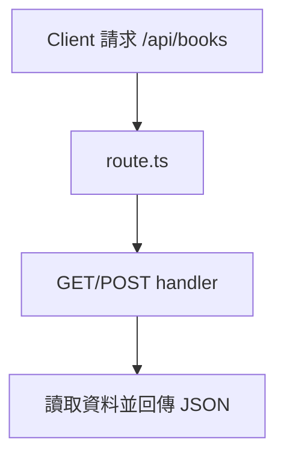
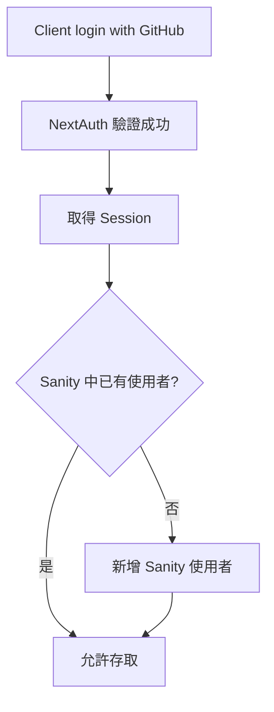

# 🧩 Next.js CMS 整合與驗證資料管理指南

本篇介紹 Next.js 與 CMS 整合的最佳實踐，包括 Sanity CMS 資料流程、API Route 建立、NextAuth 使用者驗證機制，並搭配實例程式碼與 Mermaid 圖表輔助理解。

---

## 📦 Sanity CMS 整合

### 1️⃣ Schema 定義
```ts
export default {
  name: "post",
  type: "document",
  fields: [
    { name: "title", type: "string" },
    { name: "content", type: "text" }
  ]
}
```

### 2️⃣ 查詢與取得資料 (GROQ)
```ts
import { client } from "@/sanity/client"
const data = await client.fetch(`*[_type == "post"]{ title, content }`)
```

### 3️⃣ 型別產生 + 快取
- `@sanity/type-gen` 自動生成 GROQ 對應的 TypeScript 型別
- `useCDN: true` 可啟用 Sanity 快取功能

### 4️⃣ 即時更新
```tsx
<SanityLive query={query} params={{}} />
```

---

## 🛠 API 路由實作

在 `app/api` 下建立 Route Handler：

```ts
// app/api/books/route.ts
export async function GET() {
  return Response.json([{ id: 1, title: "Next.js Guide" }])
}
```



---

## 🔐 使用者驗證（NextAuth）

### 設定基本架構：
```ts
// app/api/auth/[...nextauth]/route.ts
import NextAuth from "next-auth"
import GitHubProvider from "next-auth/providers/github"

const handler = NextAuth({
  providers: [GitHubProvider({ clientId, clientSecret })]
})
```

### Session 檢查（保護頁面）
```ts
import { getServerSession } from "next-auth"
const session = await getServerSession()
if (!session) redirect("/login")
```

### 使用者登入後同步 Sanity
```ts
callbacks: {
  async signIn({ user }) {
    const exists = await sanityCheck(user.email)
    if (!exists) await createSanityUser(user)
    return true
  }
}
```

---

## 🔄 整合流程總覽圖


