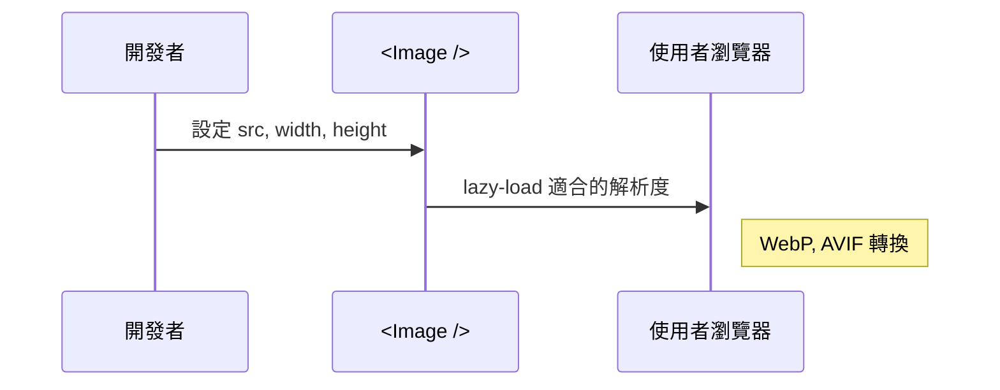
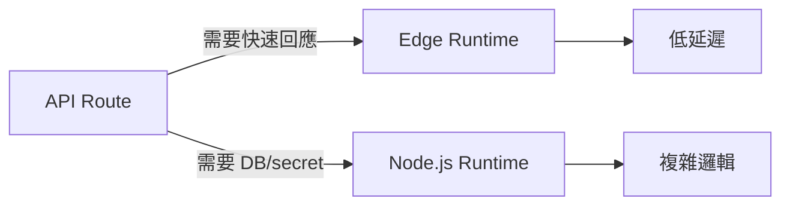
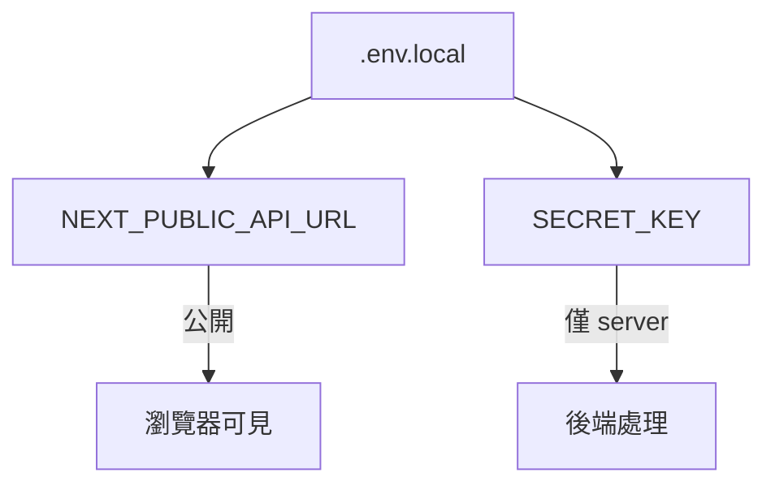
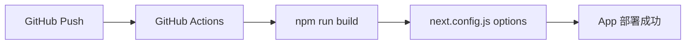

# 🧠 Next.js 高階觀念補充 Cheat Sheet

## ✅ SEO 與 metadata 管理

使用 metadata API 管理動態標題、描述、OpenGraph 以及自動產生 robots.txt 和 sitemap.xml

```mermaid
flowchart TD
    A[metadata static] -->|export const metadata| B[title, description]
    A --> C[OpenGraph, Twitter Card]
    D[generateMetadata()] -->|SSR 動態產生| B
    B --> E[Next SEO Friendly 頁面]
```

## ✅ 圖片與資源優化（Image）

Next.js Image 元件自動處理壓縮、懶加載、CDN 分發與不同 viewport 大小



## ✅ Edge Functions 與 Runtime 選擇

根據 route 或 API 需求選擇 edge function 或 node runtime，強化效能與資安



## ✅ 環境變數與部署管理

利用 .env.local / .env.production 管理不同階段變數，並在 Vercel/Cloudflare Pages 設定 UI 變數



## ✅ CI/CD 與 Build 設定

整合 GitHub Actions，使用 `next.config.js` 自定義 basePath、i18n、trailingSlash 等



