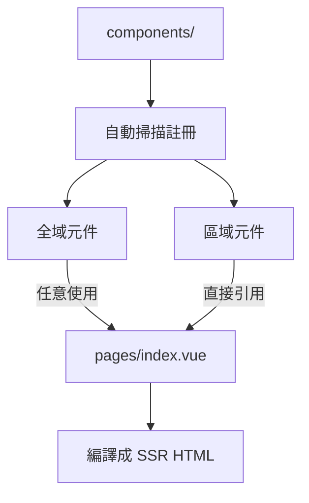

# Nuxt 3 Components 元件系統

在 Nuxt 3 中，Components 是構建 UI 的基本單位。Nuxt 提供幾種不同的元件類型以支援各種使用場景。

## 🔹 元件類型一覽

- **普通元件（Regular components）**

  - 放置於 `/components/` 目錄
  - 會自動註冊，可直接使用

- **全域元件（Global components）**

  - 被放在 `/components/global/` 或透過模組顯式註冊
  - 可以在任何頁面中直接使用

- **動態元件（Dynamic components）**

  - 使用 `<component :is="compName" />` 動態切換

- **懶加載元件（Lazy components）**
  - 使用 `defineAsyncComponent` 延遲載入

---

## 🔸 使用與導入方式

Nuxt 預設啟用元件自動註冊（Auto-import），這代表你可以不用 `import` 就在 `.vue` 中直接使用元件。

```vue
<!-- components/HelloWorld.vue -->
<template>
  <div>Hello, Nuxt 3!</div>
</template>
```

```vue
<!-- pages/index.vue -->
<template>
  <HelloWorld />
</template>
```

## 🔍 Component 對應與加載流程



## 小技巧

- 自動註冊可以在 nuxt.config.ts 中設定 components: false 關閉。
- 懶加載元件適合用於大型或不常用元件，減少首屏載入成本。

```ts
// nuxt.config.ts
export default defineNuxtConfig({
  components: {
    dirs: ["~/components", { path: "~/components/global", global: true }],
  },
});
```

## 🧩 補充：可搭配的開發模式

- 類型 建議用途
- Global Layout、Button、Card 等通用元件
- Regular 單一頁面內使用的特定元件
- Async 表單模組、Editor 等需延遲載入的元件

## 📚 參考資料

- [Nuxt 3 官方文件 - Components](https://v3.nuxtjs.org/guide/concepts/components)
- [Nuxt 3 官方文件 - Auto-import](https://v3.nuxtjs.org/guide/concepts/auto-import)
