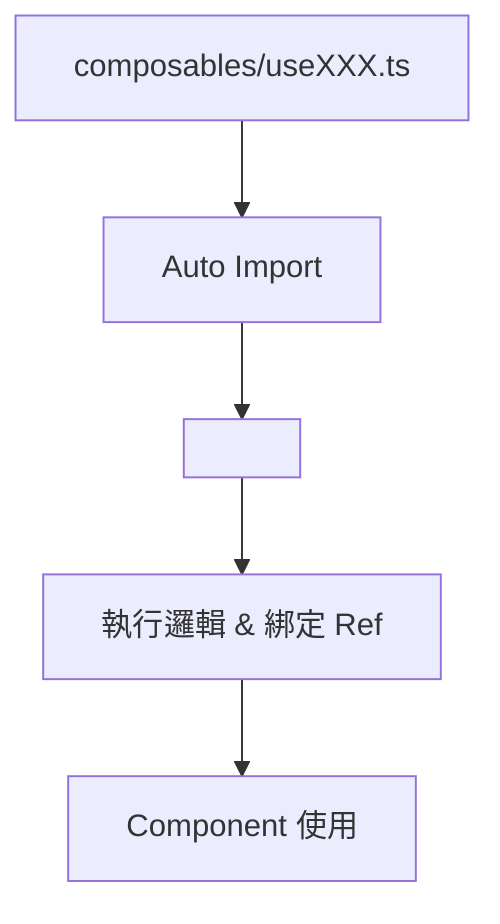
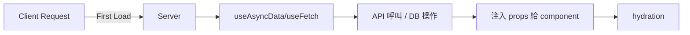

# Nuxt 3 Composables 實用函式設計

Composables 是 Vue 3 與 Nuxt 3 開發中不可或缺的概念。它們是**可重用的函式**，主要用於封裝響應式邏輯與邊界關心（separation of concerns）。

---

## 🔹 Composable 基本結構

```ts
// composables/useCounter.ts
export const useCounter = () => {
  const count = ref(0);
  const inc = () => count.value++;
  return { count, inc };
};
```

這段程式碼會在所有 .vue 中自動可用，不需要額外 import（除非你關閉自動註冊）。

```vue
<!-- pages/index.vue -->
<template>
  <button @click="inc">+{{ count }}</button>
</template>

<script setup>
const { count, inc } = useCounter();
</script>
```

## 🧠 特色

- 作用域獨立：每個組件都有自己一份 composable 實例

- 自動註冊：放在 composables/ 目錄會自動掃描

- 支援 SSR 與 Client：可判斷環境條件（如 process.server、useAsyncData）

## 🔸 Mermaid 圖：Composable 運作流程



## 🧩 常見用途類型

- 分類 功能範例
- 狀態封裝 useCounter, useToggle
- 資料取得 useFetchXxx, useAsyncDataXxx
- Cookie/Auth useUser, useAuth, useCookie
- 工具函式 useClipboard, useDarkMode

## 🚦 SSR 相容技巧

Nuxt Composables 與 SSR 整合非常緊密，可直接使用 Nuxt 提供的 useAsyncData, useFetch 等進行資料預取。

```ts
// composables/usePosts.ts
export const usePosts = () => {
  const { data, pending, error } = useFetch("/api/posts");
  return { data, pending, error };
};
```

```vue
<!-- 使用 usePosts 的元件 -->
<script setup>
const { data: posts } = usePosts();
</script>
```

🔧 Nuxt 專屬 Hook 說明
Nuxt Hook 說明
useAsyncData() 支援 SSR 的非同步資料抓取
useState() 跨元件共享響應式資料（全域狀態）
useFetch() 類似 asyncData，但可在任意位置使用
useCookie() 存取瀏覽器 cookie（支援 SSR）

## 🔍 Mermaid：Nuxt 3 Composable SSR 整合架構



## 📦 開發技巧補充

- 建議將重複邏輯與 API 整合封裝成 composables
- 可結合 useRuntimeConfig() 使用環境變數
- 支援 server-only 與 client-only 分離邏輯

```ts
if (process.client) {
  console.log("僅在 client 端執行");
}
```

## ✅ 總結

-Composables 是讓 Nuxt 3 開發更具模組性與可維護性的核心機制，搭配 script setup 與 SSR hooks，可實現高效能、結構清晰的開發模式。

## 🧩 補充：可搭配的開發模式

類型 建議用途
Global Layout、Button、Card 等通用元件
Regular 單一頁面內使用的特定元件
Async 表單模組、Editor 等需延遲載入的元件

## 📚 參考資料

- [Nuxt 3 官方文件 - Composables](https://v3.nuxtjs.org/guide/concepts/composables)
- [Nuxt 3 官方文件 - Auto-import](https://v3.nuxtjs.org/guide/concepts/auto-import)
