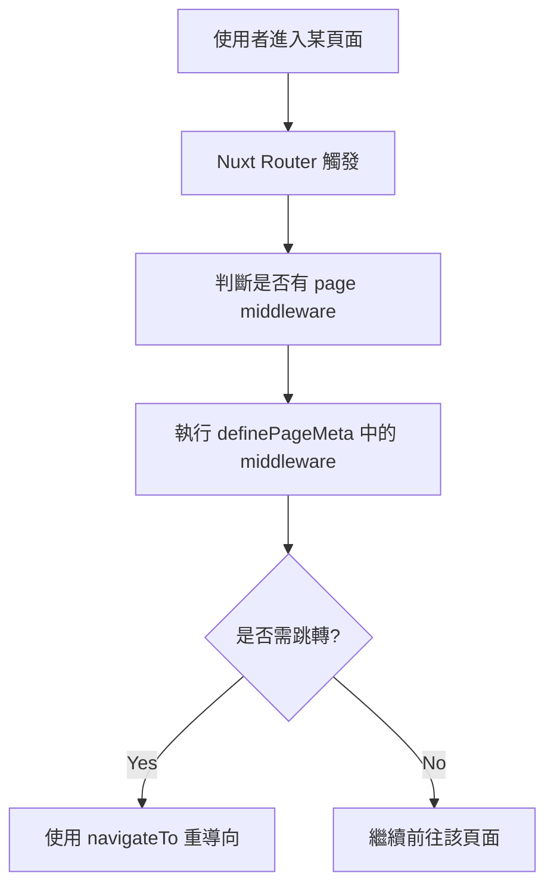

# 🛡️ Nuxt 3 Middleware 全攻略

Middleware（中介層）是 Nuxt 在導航流程中插入邏輯的機制。常見用途包含：

- 權限檢查（如未登入導向 login）
- 動態路由處理
- 日誌或記錄用戶行為

---

## 🔸 Middleware 分類

| 類型         | 執行時機與範圍                              |
| ------------ | ------------------------------------------- |
| `page-level` | 在特定頁面中透過 `definePageMeta()` 使用    |
| `global`     | 放入 `/middleware/*.global.ts` 中，全域作用 |
| `named`      | 放入 `/middleware/*.ts`，指定後才會執行     |

---

## 📁 檔案範例

```plaintext
middleware/
├── auth.global.ts    # 全站權限檢查
├── admin.ts          # 指定頁面用的中介層
```

## ✍️ 定義 Middleware（Composition API）

````ts
// middleware/auth.global.ts
export default defineNuxtRouteMiddleware((to, from) => {
const isAuthenticated = useCookie('auth_token')
if (!isAuthenticated.value && to.path !== '/login') {
return navigateTo('/login')
}
})

## 💡 在頁面中使用 Middleware

```vue
<script setup>
definePageMeta({
  middleware: 'admin'  // 使用 middleware/admin.ts
})
</script>
````

## 🔁 Mermaid：Middleware 執行流程



## 🧠 開發建議與注意事項

- 使用 useCookie()、useRoute() 等方法進行資料判斷
- 可使用 defineNuxtRouteMiddleware(name, fn) 動態註冊
- middleware/\*.global.ts 自動於每個 route 被執行

- 搭配 layout 可實作不同權限的頁面框架

## 🧩 進階搭配：SSR + Middleware

- Nuxt 3 支援 SSR 下執行 middleware，可於 server-side 完成 cookie 驗證、token 檢查，提升效能與安全性。

## ✅ 總結

### Middleware 是 Nuxt 3 中非常實用的導航前邏輯處理工具。透過簡單的檔案分類與 API，你可以實作：

- 權限控制
- 登入跳轉
- 多 layout 對應
- 前置資料驗證

#### 強烈建議與 layout、plugin 一起使用，實現乾淨且模組化的 Nuxt 架構
