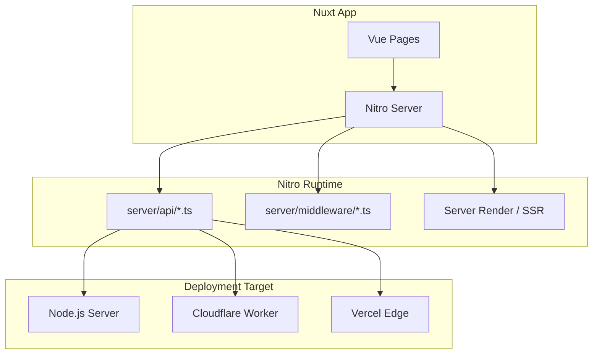

# 🚀 Nuxt 3 Nitro 引擎全解（Server Engine）

Nitro 是 Nuxt 3 的全新伺服器引擎，負責處理 Server-side rendering、API routes、Middleware、Edge Functions 等。

它是獨立的 Node 應用，也能部署到 Serverless 平台如 Vercel、Cloudflare Workers、Netlify 等。

---

## ⚙️ Nitro 核心特色

| 功能              | 說明                                                 |
| ----------------- | ---------------------------------------------------- |
| 零設定 API routes | `server/api/*.ts` 自動轉為 REST API                  |
| 自動 Middleware   | `server/middleware/` 資料夾即會註冊成中介層          |
| 跨平台支援        | 可部署至 Node.js / Lambda / Edge / Workers           |
| 快速啟動          | 使用 H3（極速 HTTP 函式庫）打造                      |
| 獨立 Runtime      | 與 Vue runtime 分離，提升 SSR + API 的效能與部署彈性 |

---

## 🧩 Nitro 專案結構（Nuxt 專用）

```plaintext
server/
├── api/
│   └── hello.ts           → GET /api/hello
├── routes/
│   └── custom.ts          → GET /
├── middleware/
│   └── auth.ts            → 進入點 middleware
```

## 📝 API 路由範例（Nitro endpoint）

```ts
// server/api/hello.ts
export default defineEventHandler((event) => {
  return { msg: "Hello from Nitro!" };
});
```

Nitro API 處理流程：

```ts
// server/api/hello.ts
export default defineEventHandler((event) => {
  const query = getQuery(event);
  const body = await readBody(event);
  const cookies = parseCookies(event);
  return { msg: "Hello from Nitro!" };
});
```

Nitro API 處理流程：

```ts
const query = getQuery(event);
const body = await readBody(event);
const cookies = parseCookies(event);
```

## ✨ Mermaid：Nitro API 處理流程

```mermaid
flowchart TD
A[Client 發送 API 請求] --> B[server/api/*.ts]
B --> C[defineEventHandler()]
C --> D[讀取 query/body/cookie 等]
D --> E[回傳 JSON Response]
```

## 🔌 Nitro Middleware 應用

可加入驗證、logging、redirect 等功能：

```ts
// server/middleware/logger.ts
export default defineEventHandler((event) => {
  console.log(`[${event.method}] ${event.node.req.url}`);
});
```

## 🌍 跨平台部署支援

| 平台               | 支援狀態                      | 說明                       |
| ------------------ | ----------------------------- | -------------------------- |
| Vercel / Netlify   | ✅ 完整支援                   | 使用 nitro preset 自動配置 |
| Cloudflare Workers | ✅ 支援 Zero cold-start，極速 |                            |
| Node Server        | ✅ 傳統部署                   | 最多自由度                 |

## 🧠 Mermaid：Nitro 部署架構總覽



🔄 開發指令與建置

# 開發模式

```bash
nuxi dev
```

# 生產環境建置

```bash
nuxi build
nuxi preview
```

# 生出 standalone Nitro app

```bash
nuxi build --preset=nitro-starter
```

## ✅ 總結

Nitro 是 Nuxt 3 背後最強的 SSR + API 引擎，具備：

- 極速 + 載量

  - 適用於 SSR、Edge Functions、API 與 Middleware

  - 支援多種部署平台

  - 用熟了就像自己架 Express + Vite 一樣靈活！
