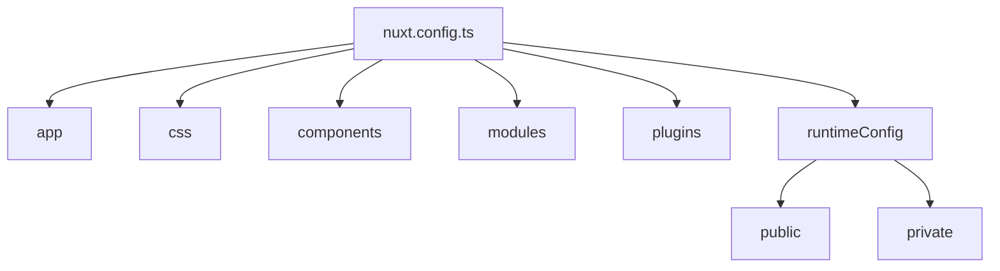
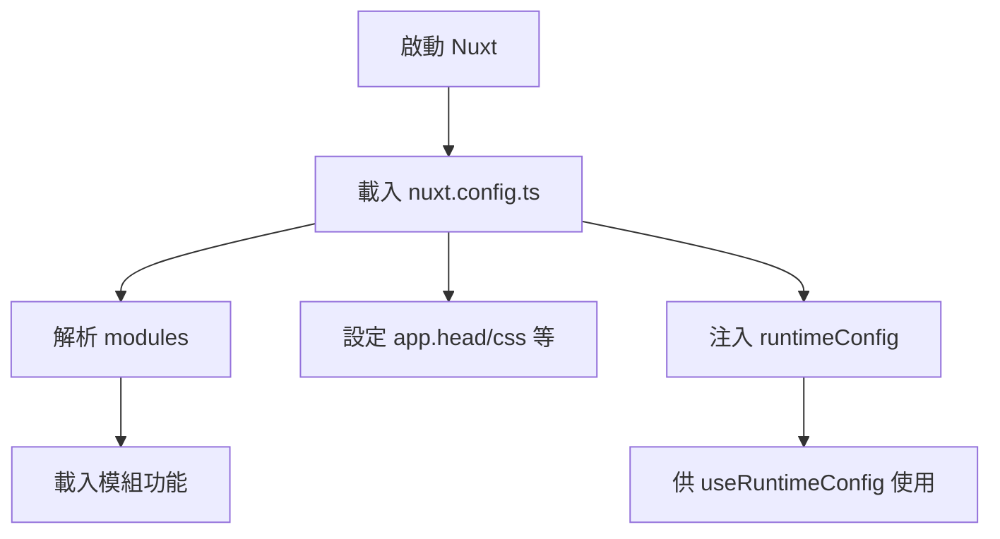

# ⚙️ Nuxt 3 設定檔 `nuxt.config.ts` 完整指南

Nuxt 3 使用 `nuxt.config.ts` 作為應用程式的設定核心。你可以透過它控制應用程式的行為、元件載入、自動匯入、模組、環境變數等。

---

## 📁 設定檔基礎架構

```ts
export default defineNuxtConfig({
  app: {
    head: {
      title: "My Nuxt App",
      meta: [
        { name: "viewport", content: "width=device-width, initial-scale=1" },
      ],
    },
  },
  css: ["~/assets/main.css"],
  components: true,
  modules: ["@nuxtjs/tailwindcss"],
  runtimeConfig: {
    public: {
      apiBase: "/api",
    },
    privateToken: process.env.PRIVATE_TOKEN,
  },
});
```

📊 Mermaid 圖：Nuxt 設定檔功能分類總覽



🔹 app.head：定義全站 <head> 資訊

用來設置 HTML 標籤中 <title>、<meta>、<link> 等。

```ts
app: {
  head: {
    title: "My Cool App",
    link: [{ rel: "icon", type: "image/x-icon", href: "/favicon.ico" }],
  },
},
```

}

🎨 css：全域樣式導入

Nuxt 支援自動匯入 CSS、SCSS、Tailwind 等全域樣式檔。

```ts
css: ["~/assets/styles.scss"];
```

🧩 components：元件自動註冊

Nuxt 可自動掃描 components/ 下的 .vue 檔案並全域註冊。

```ts
components: {
  dirs: ["~/components", { path: "~/components/global", global: true }];
}
```

## 🔌 plugins：插件設定

在 plugins/ 目錄下建立 plugin 並使用 defineNuxtPlugin 匯出。可選擇 client/server only。

```ts
plugins: ["~/plugins/axios.ts"];
```

## ⚙️ modules：Nuxt 模組載入點

常見模組如 @nuxtjs/tailwindcss, @vueuse/nuxt, @pinia/nuxt 等。

```ts
modules: ["@nuxtjs/tailwindcss", "@pinia/nuxt"];
```

## 🔐 runtimeConfig：環境變數（public/private）

Nuxt 3 引入 runtimeConfig 來區分公開與私密變數，支援 .env 檔匯入。

```ts
runtimeConfig: {
  public: {
    apiBase: "/api",
  },
  privateToken: process.env.SECRET_TOKEN,
};
```

可在 composable 中使用：

```ts
const config = useRuntimeConfig();
console.log(config.public.apiBase);
```

## 🧠 建議最佳實務

項目 說明
app.head 建議集中設置 SEO 與 viewport 等標籤
css 統一使用 SCSS + Tailwind 輔助開發
runtimeConfig 公私變數明確區分，避免外洩敏感資訊
modules 模組配置建議統一於此維護，利於除錯

## 🔁 Mermaid：設定套用流程



##

✅ 總結

    nuxt.config.ts 是 Nuxt 專案的中樞

    支援 TypeScript 提示與模組型設計

    配合 runtimeConfig, app, modules, plugins 可完整控制專案行為
