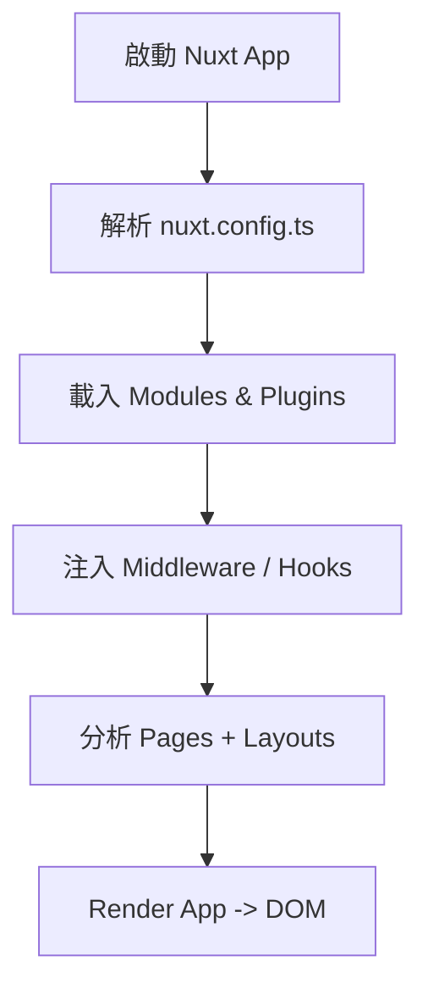
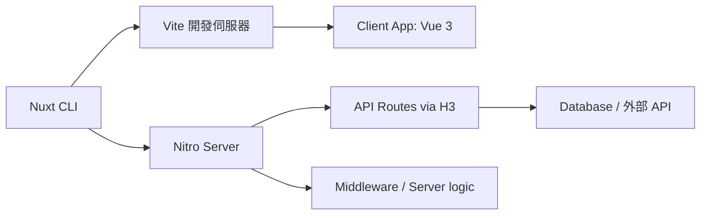

# 🚀 Nuxt 3 核心概念 Core System Guide

Nuxt 3 的核心架構基於 **Vue 3 + Vite + Nitro**，同時結合 `file-based routing`、`auto-import`、`server rendering` 等高階特性，打造現代 Web 應用基礎。

---

## 🔧 核心技術總覽

| 技術        | 角色說明                               |
| ----------- | -------------------------------------- |
| Vue 3       | 前端框架基礎                           |
| Vite        | 極速打包與開發伺服器                   |
| Nitro       | 後端 Runtime engine，支援跨平台部署    |
| H3          | HTTP handler（支援中介層、endpoint）   |
| Auto Import | 自動匯入 composable、utils、components |

---

## 📦 核心目錄結構（推薦）

```plaintext
.
├── assets/             # 靜態樣式、圖片等資源
├── components/         # Vue 元件
├── composables/        # 可重用邏輯函式（自動註冊）
├── pages/              # 基於檔案的路由
├── layouts/            # 頁面樣板
├── plugins/            # 插件註冊點
├── public/             # 靜態公開資源（例如 favicon）
├── server/             # API routes / middleware / handlers
├── app.vue             # 預設根組件
├── nuxt.config.ts      # 設定檔
```

## 🔁 Nuxt 應用啟動順序



## 🔌 Plugin vs Composable 差異

### Plugin

- 注入 app.config.globalProperties 或上下文物件（如 $axios, $auth）
- 支援 server/client only 註冊

### Composable

- 純函式，封裝 reactive 或邏輯
- 適合任何地方呼叫，支援自動匯入

```ts
// plugins/axios.ts
export default defineNuxtPlugin(() => {
  const api = $fetch.create({ baseURL: "/api" });
  return {
    provide: { api },
  };
});

// composables/useCounter.ts
export const useCounter = () => {
  const count = ref(0);
  return { count };
};
```

## 🌐 Nuxt Server Engine (Nitro)

Nitro 是 Nuxt 的跨平台伺服器引擎，支援：

- AWS Lambda、Cloudflare Workers、Vercel、Netlify 等部署
- Zero config routing（類似 Next.js API routes）
- .ts 支援與 auto-import middleware

##🧬 Mermaid：核心架構圖



## 🧠 補充建議

- 可使用 server/api/ 建立 REST API 或 handler
- app.vue 為 App 根層，可當全局 wrapper 用（例如加入 progress bar）
- CLI 中使用 nuxi 可快速 scaffold 功能

## ✅ 總結

- Nuxt 3 的核心結構非常模組化，底層以 Nitro 取代過去 Nuxt 2 的 serverMiddleware 設計，適合部署在現代伺服器平台如 Cloudflare Workers、Vercel、Netlify 等。建議配合 server/, plugins/, composables/ 等目錄搭配設計，實現高效分層架構。
