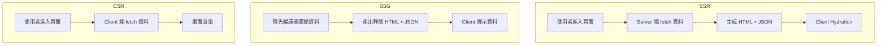

# ⚡ Nuxt 3 資料取得與頁面渲染（Data Fetching & Rendering）

在 Nuxt 3 中，資料的取得方式比過去更加彈性，支援 SSR / CSR / 預取，還能透過 `useAsyncData`, `useFetch`, `useState` 等工具，在頁面渲染前或過程中取得資料。

---

## 📦 核心 API 比較表

| API            | 是否支援 SSR | 作用範圍             | 備註                             |
| -------------- | ------------ | -------------------- | -------------------------------- |
| `useFetch`     | ✅           | 任意組件內           | 包裝 `$fetch`，可抓 API          |
| `useAsyncData` | ✅           | `setup()` / 外層使用 | 更彈性資料來源（API / local fn） |
| `useState`     | ✅           | 跨元件共享資料       | 支援 server/client 可序列化      |

---

## 💡 useFetch 基本用法

```ts
const { data, pending, error } = await useFetch("/api/user");
```

可用在 SSR or CSR 階段，Nuxt 會自動處理快取與預取。

🧠 useAsyncData 搭配函式

```ts
const { data } = await useAsyncData("posts", () => $fetch("/api/posts"));
```

你也可以搭配參數變化自動 refetch：

```ts
const route = useRoute();
const { data } = await useAsyncData(
  () => `post-${route.params.id}`,
  () => $fetch(`/api/posts/${route.params.id}`)
);
```

## 🔁 Mermaid：資料取得流程（通用型）

```mermaid
flowchart TD
A[使用者訪問頁面] --> B[setup() 內執行 useFetch/useAsyncData]
B --> C[Server 預先取得資料]
C --> D[資料注入 props 傳給 component]
D --> E[Client Hydration]
E --> F[可選擇性 CSR Refetch]
```

## 📄 Static vs SSR 比較

- 模式 資料來源方式 SEO 友善 初始速度 可搭配 useAsyncData?
- SSR server render → HTML + JSON ✅ 普通 ✅
- SSG (預產生) build 階段預先抓取 + 緩存 ✅ 🚀 快 ✅
- SPA/CSR client only fetch ❌ 依 fetch 而異 ✅ / fetch

## 🌐 Mer maid：不同模式渲染架構比較



## 🧩 useState 的進階共享應用

```ts
// composables/useCounter.ts
export const useCounter = () => useState("counter", () => 0);
```

這個狀態會自動跨頁共享，並支援 SSR → CSR hydration。

## 🧪 建議搭配開發方式

| 類型                        | 建議使用 API |
| --------------------------- | ------------ |
| 需要 SEO / 初次渲染就有資料 | useAsyncData |
| Client only 操作            | useFetch     |
| 跨元件 / 全域暫存           | useState     |

## ✅ 總結

- Nuxt 提供了彈性且強大的資料取得方式，讓開發者可以依据实际应用情境：

  - 在服務器階段先行抓取数据（SSR / SSG）
  - 客户端再執行補充數據（CSR）

  - 跨頁面共享狀態（useState）
