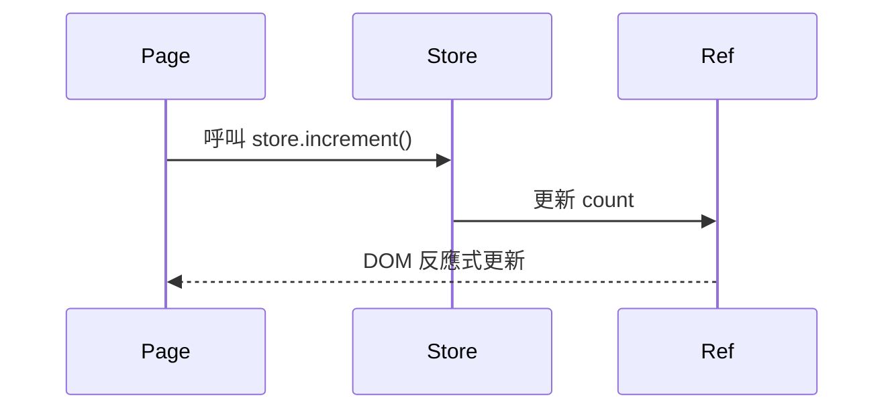
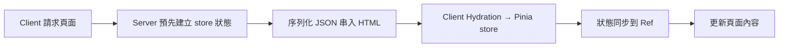

# 🧠 Nuxt 3 狀態管理：Pinia 全攻略（整合 Nuxt 應用）

Nuxt 3 已內建整合 [Pinia](https://pinia.vuejs.org/)，作為官方建議的狀態管理工具，支援 SSR、Hydration、Module 化與 DevTools。

---

## 🔧 安裝與啟用

你只需加入模組即可開始使用 Pinia：

```ts
// nuxt.config.ts
export default defineNuxtConfig({
  modules: ["@pinia/nuxt"],
});
```

## 🏗️ 建立一個基本 Store

```ts
// stores/counter.ts
import { defineStore } from 'pinia'

export const useCounterStore = defineStore('counter', () => {
const count = ref(0)
const double = computed(() => count.value \* 2)
const increment = () => count.value++

return { count, double, increment }
})
```

## 💡 使用 Store 的方法

```vue
<script setup>
const counter = useCounterStore();
</script>

<template>
  <button @click="counter.increment()">Count: {{ counter.count }}</button>
</template>
```

## 🧬 Mermaid：Pinia Store 結構關係

```mermaid
graph TD
A[defineStore('counter')] --> B[count: ref(0)]
A --> C[double: computed]
A --> D[increment: function]
B --> E[頁面組件使用]
C --> E
D --> E
```

🧩 Options API 模式（舊式寫法）

```ts
export const useUserStore = defineStore({
  id: "user",
  state: () => ({
    name: "",
    loggedIn: false,
  }),
  actions: {
    login(name) {
      this.name = name;
      this.loggedIn = true;
    },
  },
});
```

📦 Store 資料夾結構建議

```plaintext
stores/
├── counter.ts # 數值增減
├── user.ts # 使用者登入狀態
├── settings.ts # 偏好設定
```

##🔁 Mermaid：Store in Page → State Update Flow



## 🌐 跨頁共享狀態（SSR 支援）

Pinia store 可在 SSR 階段建立與注入，Nuxt 會自動處理 hydration：

```ts
export const useSettingsStore = defineStore("settings", () => {
  const darkMode = ref(false);
  const toggle = () => (darkMode.value = !darkMode.value);
  return { darkMode, toggle };
});
```

## 📄 Mermaid：SSR Hydration + Store 建立流程



## 🧠 與 Nuxt Composables 搭配

```ts
const auth = useUserStore();
watch(
  () => auth.loggedIn,
  (val) => {
    if (!val) navigateTo("/login");
  }
);
```

## 🔥 與 Middleware、Plugin 搭配

```ts
// middleware/auth.ts
export default defineNuxtRouteMiddleware(() => {
  const auth = useUserStore();
  if (!auth.loggedIn) return navigateTo("/login");
});
```

## ✅ 總結

Pinia 提供了強大的狀態管理能力，與 Nuxt 的整合也十分自然，你可以：

- 使用 defineStore() 定義 store
- 在任何組件中使用 store
- 與 Nuxt 的其他功能（如 composables、middleware）搭配使用
- 支援 SSR、Hydration、DevTools 等

## ✅ Pinia 總結

| 特性            | 支援             |
| --------------- | ---------------- |
| 多 store 模組   | ✅ 自由分檔管理  |
| SSR / Hydration | ✅ 全自動        |
| DevTools 支援   | ✅ Vue DevTools  |
| TypeScript 提示 | ✅ 完善型別推導  |
| 自動匯入 store  | ✅ Nuxt 自動啟用 |

## 🧠 開發建議

- 每個核心業務邏輯可建立一個 store 模組（user、cart、setting、admin）
- SSR 下避免直接存取瀏覽器 API（如 localStorage）
- 建議使用 defineStore() 的組合式寫法，更彈性且可讀性高

## 📚 進階延伸

- 自動同步至 localStorage → 搭配 pinia-plugin-persistedstate
- 使用 storeToRefs() 展平 store → 解決解構失去響應性問題
- VueUse 搭配 store 寫出強大響應邏輯

```ts
import { storeToRefs } from "pinia";
const { count } = storeToRefs(useCounterStore());
```
